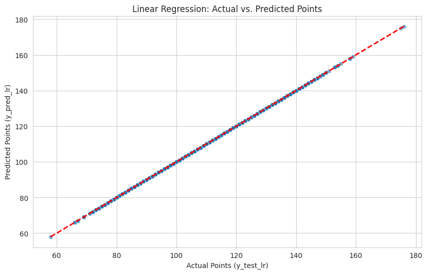
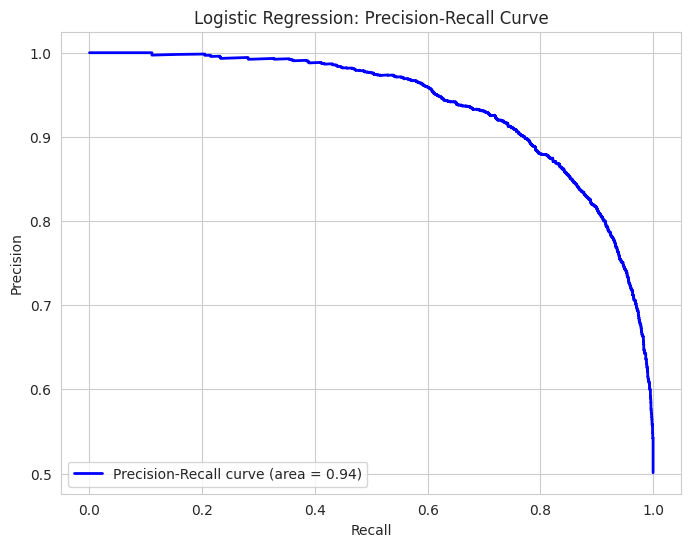

# Rapport d'analyse: NBA 2012–2024

Ce projet propose une analyse des données de la NBA entre les saisons 2012 et 2024, ainsi que deux modèles de machine learning : une régression linéaire pour prédire le nombre de points marqués et une régression logistique pour prédire l’issue d’un match (victoire/défaite).

## Sommaire

- Description du jeu de données  
- Méthodologie générale  
- Régression linéaire  
- Régression logistique  
- Principaux enseignements 

## Introduction

La NBA génère un volume important de données à chaque saison (scores, pourcentages au tir, rebonds, pertes de balle, etc.).  
L’objectif de ce projet est de montrer comment exploiter ce type de données pour construire des modèles prédictifs simples mais interprétables, qui peuvent servir de base à des analyses plus poussées (par exemple pour le scouting, les paris sportifs ou la visualisation avancée).

## Description du jeu de données

Le jeu de données contient des enregistrements de matchs de saison régulière NBA de 2012 à 2024, au niveau des équipes.  
Chaque ligne correspond à une équipe dans un match donné (un match apparaît donc deux fois, une fois pour chaque équipe). Parmi les variables typiques, on trouve :

- Contexte du match : saison, date, domicile/extérieur, identifiants d’équipe.  
- Statistiques de box-score : points marqués, tentatives et réussites aux tirs, tirs à trois points, lancers francs, rebonds, passes décisives, interceptions, contres, balles perdues, fautes.  
- Variables de résultat : indicateur de victoire/défaite, écart de points final.

## Méthodologie générale

La démarche suivie dans ce projet est la suivante :

1. **Chargement et nettoyage des données**  
   - Import du fichier CSV, conversion des types (numérique/catégoriel), traitement des valeurs manquantes.  
   - Suppression des doublons et des enregistrements incohérents.

2. **Analyse exploratoire (EDA)**  
   - Visualisation des distributions (points marqués, pourcentages de tir, écarts de points).  
   - Étude des corrélations entre variables explicatives et variables cibles (points, victoire).

3. **Ingénierie de variables**  
   - Création de métriques d’efficacité (eFG%, TS%, points par possession, taux de pertes de balle, taux de rebond, etc.).  
   - Encodage des variables catégorielles (par exemple une variable binaire “home/away”).

4. **Modélisation**  
   - Régression linéaire pour prédire le nombre de points marqués par une équipe lors d’un match.  
   - Régression logistique pour prédire la probabilité de victoire d’une équipe.  

5. **Évaluation**  
   - Régression linéaire : \(R^2\), MAE et RMSE.  
   - Régression logistique : précision, rappel, F1-score, courbe ROC, courbe précision–rappel.

## Régression linéaire

La régression linéaire est utilisée pour modéliser la relation entre différentes statistiques de match (pourcentages au tir, volume de tirs, rebonds offensifs, pertes de balle, etc.) et le nombre total de points marqués par une équipe.  
Le modèle fournit un cadre simple pour interpréter l’impact de chaque variable sur le score attendu.

Sur ce graphique, l’axe horizontal représente les points réellement marqués et l’axe vertical les points prédits par le modèle.  
La ligne pointillée rouge correspond à la prédiction parfaite : plus les points bleus sont proches de cette diagonale, plus le modèle est précis. L’alignement serré des observations autour de cette ligne montre que les statistiques de box-score expliquent bien la variance du nombre de points.

## Régression logistique

La régression logistique prend des caractéristiques similaires (efficacité offensive, rebonds, turnovers, avantage domicile, etc.) mais cherche cette fois à prédire la probabilité qu’une équipe gagne le match.  
Le modèle renvoie une probabilité de victoire comprise entre 0 et 1, qui peut ensuite être transformée en prédiction binaire (victoire/défaite) via un seuil (par exemple 0,5).

La courbe précision–rappel ci‑dessus montre comment évoluent la précision et le rappel lorsque l’on fait varier ce seuil.  
Une aire sous la courbe proche de 1 (par exemple 0,94) indique qu’il est possible de maintenir une précision élevée tout en identifiant une grande proportion de matchs gagnés, ce qui témoigne d’un bon pouvoir discriminant du modèle pour distinguer les victoires des défaites.

## Principaux enseignements

- Les statistiques classiques de box-score, combinées à quelques variables de contexte, suffisent déjà à construire des modèles prédictifs efficaces sur plusieurs saisons NBA.  
- La régression linéaire fournit une base interprétable pour comprendre comment chaque statistique influence le nombre de points marqués.  
- La régression logistique permet de traduire ces mêmes informations en probabilités de victoire, utiles pour le suivi de performance, la prise de décision et la détection de matchs à risque.  
- Cette architecture (nettoyage, EDA, ingénierie de variables, modèles linéaires, visualisations) constitue un bon point de départ pour tester ensuite des modèles plus complexes (forêts aléatoires, gradient boosting, réseaux de neurones).
